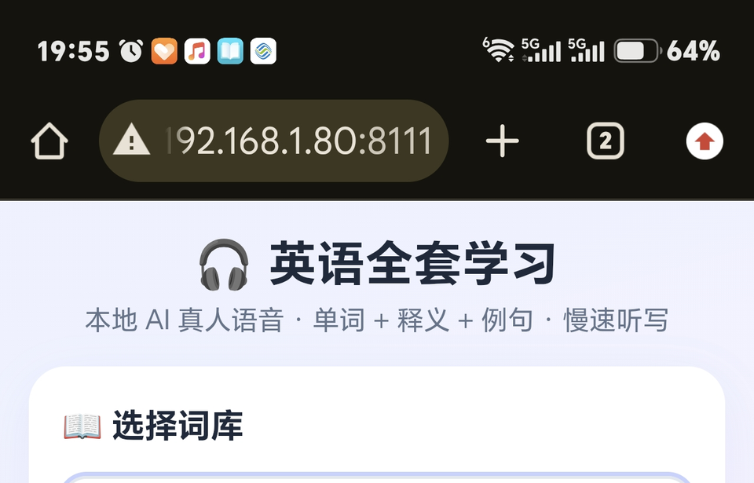
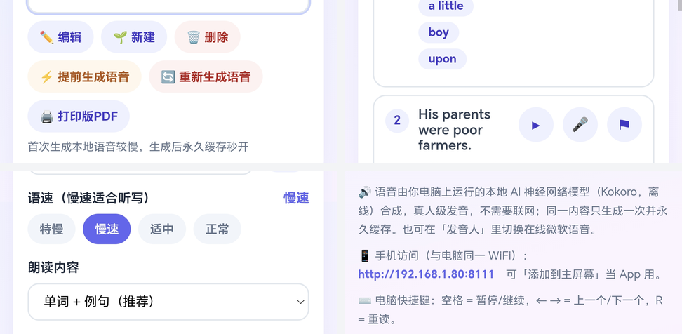

# 英语全套学习（English All-in-One）

给孩子用的英语全套学习软件：听写、背诵、跟读评分、词书导入，**本地 AI 真人语音**朗读单词、释义、例句，支持整篇双语文章逐句听写、跟读录音 AI 评分、PDF 词书导入，全程离线免费。

起因是想给学英语的孩子做一个不枯燥的听写工具，后来发现身边家长都有同样的需求，就开源出来送给有需要的人。



## 📷 界面一览



## ✨ 功能

- **本地 AI 真人语音**（Kokoro-82M 神经网络，8 种音色，语速 0.5~1.0 可调；慢速采用广播级变速不变调处理，无电音不吞字）
- **听写模式**：逐词/逐句朗读 → 孩子拼写 → 自动批改，支持按页听写、自动重读、间隔可调
- **遮住自测**：遮中文/遮英文点开核对，适合背诵
- **错句标注**：写错的句子一键 ⚑ 标记（红色高亮、长期保存），「只看错句」一键过滤出错题重听
- **跟读发音评测**：🎤 录音 → 本地 AI 识别 → 打分并指出哪个词错读/漏读 → 回放自己的录音（录音时长自动按句子长度×3 适配，长句背书不被截断）
- **双语文章逐句听写**：粘贴中英对照的课文/短文，自动按句拆分、逐句配对中文（引号感知：对话保持整句）
- **PDF 词书导入**：普通 PDF 直接提取文字；**扫描图片版 PDF 自动 AI 识别（OCR）**，按页码范围导入；解析结果进独立校对页逐条人工核对后再入库
- **词库管理**：内置 4000 词初中+中考/高考词库（含例句）、原创 60 篇中考短文（整篇背诵 + 逐句听写 + 可打印 PDF 练习册）；增删改查、批量导入、按页浏览
- **打印练习册**：一键导出每篇一页的背诵/默写两用 PDF
- **手机同用**：同一 WiFi 手机浏览器直接用，支持"添加到主屏幕"当 App；iPhone 跟读录音走 HTTPS
- **断点续跑**：语音批量预生成中途断电重启后自动接续

## 🚀 快速开始

要求：Windows（Mac/Linux 理论可用，脚本未适配）、Python 3.10+

```bash
# 1. 安装依赖（国内可加 -i https://mirrors.aliyun.com/pypi/simple/）
pip install -r requirements.txt

# 2. 下载语音模型（约 400MB，一次性；国内自动走 hf-mirror 镜像）
python setup_models.py

# 3. 启动
python server.py
```

浏览器打开 http://localhost:8111 即可。

### 手机使用（同一 WiFi）

浏览器打开启动窗口显示的 `http://电脑IP:8111`，可"添加到主屏幕"当独立 App 用。

**iPhone 跟读录音**需要 HTTPS（系统限制）：运行 `gen_cert.bat` 生成证书后，用 `https://电脑IP:8112` 访问，信任一次证书即可。

## 📖 典型用法（家长版）

1. **日常听写**：选词库 → 翻到今天要学的页 → 点「⚡ 提前生成语音」→「开始听写（本页）」
2. **背课文**：把中英对照课文粘贴进"新建 → 句子库 → 🤖 智能解析"，自动逐句配对，校对后保存；「遮住英文」看中文复述，「遮住中文」看英文翻译
3. **导入纸质词书**：拍照版 PDF 也能用——上传后选页码范围 OCR 识别 → 校对页核对 → 入库
4. **周末打印**：短文库选中 →「🖨 打印版PDF」→ 打印出来纸笔默写

## 📁 目录说明

```
server.py        服务端（内置 HTTP 服务 / TTS / 评测 / OCR）
index.html       主页面（单文件应用）
review.html      导入校对页
data/            词库数据（JSON，备份这个目录即可）
                 其中 demo_essay.json 为演示数据（某教材短文节选两句，
                 仅展示“双语文章逐句导入”的效果）
setup_models.py  模型下载脚本（模型不进 Git，首次运行一次）
gen_cert.bat     生成 iPhone 录音用的 HTTPS 证书
```

自建词库保存在 `data/l*.json`，已 gitignore，不会误传到网上。

## 🧩 技术与致谢

- 语音合成 [Kokoro-82M ONNX](https://huggingface.co/onnx-community/Kokoro-82M-v1.0-ONNX)（Apache-2.0），慢速变速使用 ffmpeg atempo / audiotsm
- 发音评测 [Vosk](https://alphacephei.com/vosk/) 离线识别（Apache-2.0），词级编辑距离比对评分
- 扫描版 PDF 识别 [RapidOCR](https://github.com/RapidAI/RapidOCR)（Apache-2.0）
- 部分例句来自 [Tatoeba](https://tatoeba.org/) 句库（CC-BY 2.0 FR），已随词库数据分发，在此致谢
- 60 篇中考短文为本项目专门编写（AI 辅助创作的原创内容，未摘自任何出版物），
  随库分发；如认为某篇与您的作品雷同，请提 Issue，我们会核实替换

## ⚠️ 使用说明

- 本项目完全本地运行（edge-tts 在线音色为可选备用），不上传任何数据，录音只保存在本机 `recordings/`
- 请勿将受版权保护的图书内容（词书扫描件、配套词库等）导入后公开分发；
  仓库自带的 `data/demo_essay.json` 仅为格式演示，节选自市面教材两句并已改名

## License

[MIT](LICENSE)
